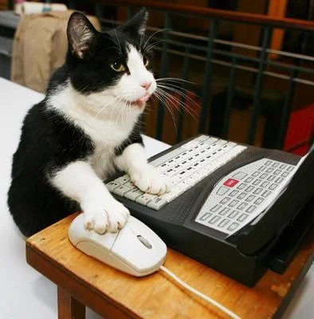

# PLUSZOWE NIEDŹWIADKI

Raz uciekły z pozłacanej klatki Cztery małe, **pluszowe niedźwiadki,** Jeden łkał, wracać chciał, Do ciemnego lasu wejść się bał. Mały miś, do lasu bał się iść, Ze strachu drżał jak liść, pluszowy miś. Ciemny las, tam wilki zjedzą nas, Wracajmy bracia wraz, dopóki czas!

Nie bój się wilki nie zjedzą cię! Będziemy bronić się, nie damy się! Śmiało w przód, po słodki, wonny miód, Jagody, istny cud, użyjem w bród! Trzy niedźwiadki, rety, co za heca, *Babę Jagę wsadziły do pieca, Teraz wieść muszą nieść,* ~~Już nie będzie Baba Jaga dzieci jeść.~~

Mały miś, do lasu bał się iść, Ze strachu drżał jak liść, pluszowy miś. **Ciemny las, tam wilki zjedzą nas,** Wracajmy bracia wraz, dopóki czas! Nie bój się wilki nie zjedzą cię! Będziemy bronić się, nie damy się! Śmiało w przód, po słodki, wonny miód, *Jagody, istny cud, użyjem w bród!*

> Wspaniały utwór. muz. Piotr Kalina/sł. Jadwiga Prawdzic-Szczawińska M.J. 

1. Pierwsza pozycja
2. Druga pozycja
   1. jakies wcięcie
4. Trzecia pozycja

Lista zakupów:
- mleko
- ser
    - cheddar lub gouda

```
      <table>
          <tr>
              <td>Part 1</td>
          </tr>
      </table>
```
1. Przeanalizuj poniższy kod:
```
        <html>
          <head>
            <title>Test</title>
          </head>
```
2. Zrób cośtam


